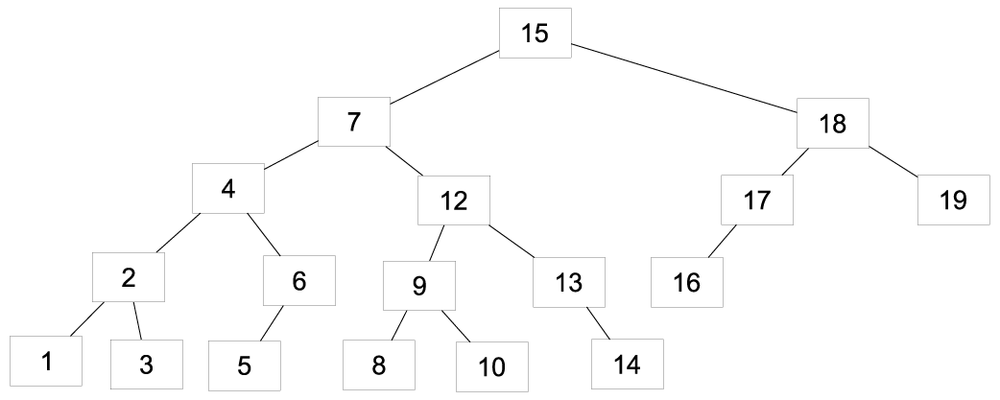

Aufgabenstellung
================

Gegeben sei der folgende AVL-Baum.

1. Fügen Sie den Knoten 0 ein (ausgehend vom Baum oben) und balanzieren Sie den Baum.
2. Fügen Sie den Knoten 11 ein (ausgehend vom Baum oben) und balanzieren Sie den Baum.

Lösung
======

